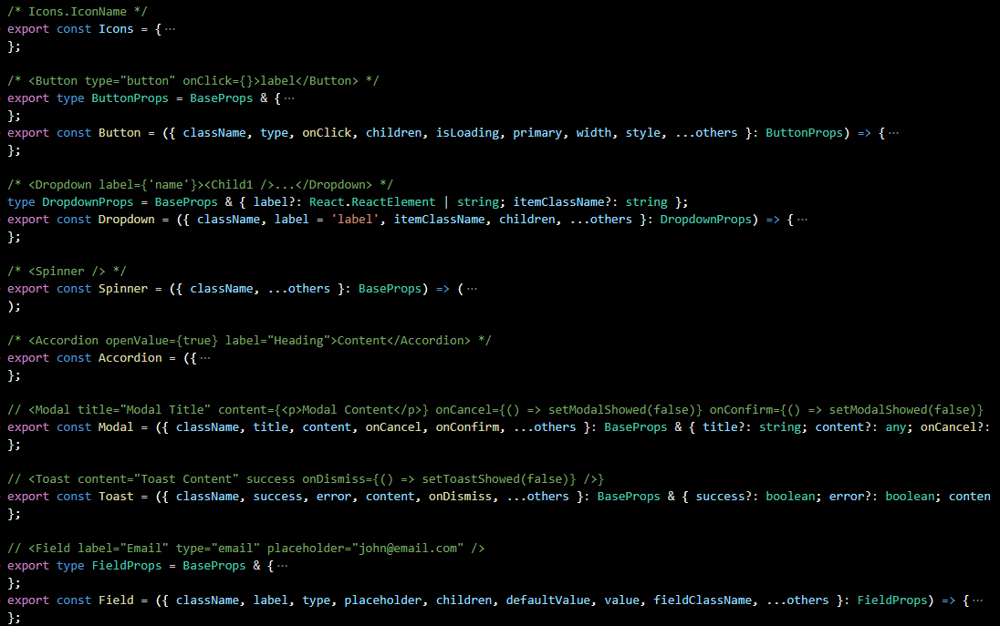

# portable-react

Simple, lightweight React components written in Typescript using Tailwind CSS, all in one index.tsx file ~ 300 lines of code. No dependencies.

- [Live Playground](https://stackblitz.com/edit/portable-react-example?file=index.tsx)
- [Code Example](./portable-react/example/src/App.tsx)
- Components: Playground: Button, Dropdown, Accordion, Modal, Toast, Form Field, Spinner, Tooltip, ProgressBar, SearchInput and more. Work on responsive / mobile screens.

### Usage

- Just copy [index.tsx](./portable-react/src/index.tsx) file to your project to use it.

- Include tailwind.min.css in your index.html using: `<link href="https://unpkg.com/tailwindcss@^2/dist/tailwind.min.css" rel="stylesheet">`

### Motivation

This is Not Another Component Library, rather a set of building blocks, all in one file. You can jump in quickly, look at a few line of codes, tweak it, or do whatever you want, which is very useful for small projects.

> Oftentimes, when starting a new project, I need to quickly use some basic React components but I don't want to spend time to install, set up, import and RTFM to use a full-fledged Component Library yet. Inspired by PortableApps I used in the past (which you can just copy and use an application binary file anywhere), I created this collection of simple React components, all in one index.tsx file. You can just copy that file to any React project, tweak it and start using it immediately.
 

### Using npm

For those who want to use npm, install it by running: `npm install portable-react --save`

### Development

- See: [Development](docs/DEV.md)
